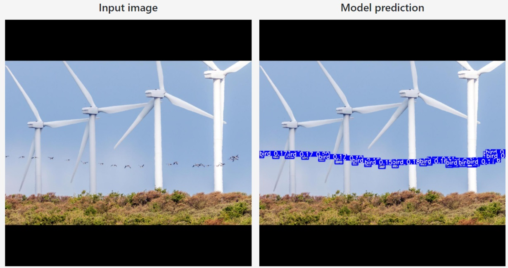

# WindTurbineBirdDetector
It's a bird? It's a plane? It's... an internship project assessment!

>Input image source: https://scitechdaily.com/wind-turbines-harm-birds-these-design-and-placement-rules-could-minimize-the-impact/

Renewable energy is an increasingly more important topic as time goes by. One method to obtain such energy is with wind turbines in wind parks. Common places are often remote such that the turbines don't bother people, but these places are also common grounds for many bird species. With this project, we attempt to detect these birds near wind turbines.

## How it's done
[Yolor](https://arxiv.org/abs/2105.04206) is used as the AI architecture considering its excellent performance on the COCO dataset. [This](https://blog.roboflow.com/train-yolor-on-a-custom-dataset/) tutorial was used to initialise our repository. We use Yolor_p6 with its 1280 x 1280 input resolution. To obtain a dataset, we used [google-image-downloader](https://github.com/Joeclinton1/google-images-download.git) to download approximately 400 images from google. After removing the duplicates, unrelated images, and images where I was not able to isolate individual birds, we end up with a dataset of 191 images. This dataset is freely available and can be downloaded [here](https://app.roboflow.com/wightslayer/wind-turbine-bird-detection). After training the model, we set the confidence threshold to 0.1 to balance the recall/precision tradeoff.

To make the trained bird detector available over the internet, we used [Flask](https://flask.palletsprojects.com/en/1.0.x/) and [Bootstrap](https://getbootstrap.com/) following [this](https://www.youtube.com/watch?v=BUh76-xD5qU&t=2149s) tutorial. All python code for the website is located in webservice.py, the HTML for the website is located in the 'templates' folder and the corresponding css/js is located in the 'static' folder. When the website is online, any image uploaded to the website is saved and the prediction of the model is shown inside the webpage.

## Installation & Usage

Getting the repository:
`git clone https://github.com/Wightslayer/WindTurbineBirdDetector.git`

Installing the dependencies:
`conda env create -f BirdDetectorEnv.yml`

